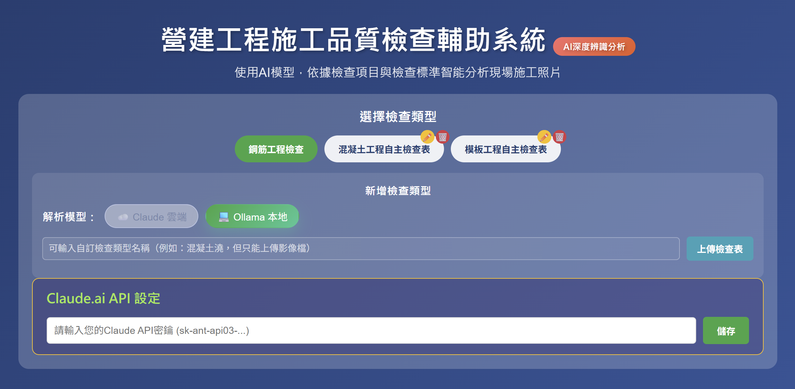
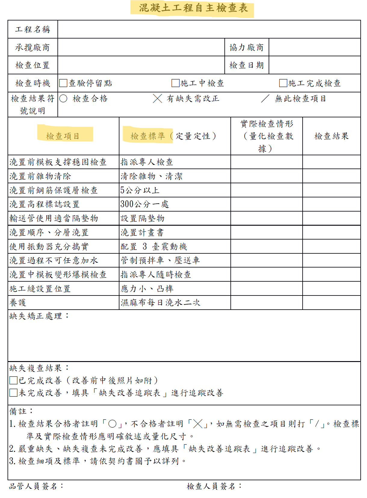

# 🏗️ AI施工品質檢查系統 - 雙模版本

> 本文件整合了主專案說明、Claude 雲端模式說明、 Ollama 本地端模式設定說明。

---

## 📚 目錄

1. [專案總覽與使用說明](#專案總覽與使用說明)
2. [Claude 雲端模式說明](#claude-雲端模式說明)
3. [Ollama 本地模式說明](#ollama-本地模式說明)

---

## 🧱 專案總覽與使用說明

# 🏗️ 施工品質檢查 - AI生成式輔助系統（雙模版本）

本專案源自 [Williamtt/AIQuality](https://github.com/Williamtt/AIQuality.git)  
使用 **VS Code + GPT5-CODEX** 編程開發。
主要是新增了本地端模型的使用功能



---

## 💡 系統簡介

1. **商業付費模式**：使用雲端 Claude AI 智能分析鋼筋工程照片，自動識別缺失項目與檢查標準。  
2. **本地端免付費模式**：使用 Ollama + Qwen2.5-VL:7B AI 模型，自動識別缺失項目與檢查標準。  
3. **優缺點比較**：  
   - 商業付費模式：精準度高、速度快  
   - 本地端免付費模式：精準度較低，速度偏慢（無獨立顯卡狀態）

---

## ✨ 功能特色

- 🤖 **AI 智能分析**：依據檢查類型分析施工照片（雲端使用 Claude-3.7-Sonnet、本地使用 Qwen2.5-VL:7B）。  
- 📋 **專業檢查項目**：依據檢查表自動載入項目。  
- 📸 **照片上傳**：支援拖曳或選擇圖片上傳。  
- 🎯 **精確識別**：AI 自動判斷缺失並提供改善建議。

---

## 🚀 快速開始

### 前置要求

- Node.js 18+  
- npm  

雲端 AI 模式：
- Claude API 密鑰（需付費）  
  👉 [取得 API Key](https://console.anthropic.com/login?selectAccount=true&returnTo=%2Fsettings%2Fkeys%3F)

本地端 AI 模式（請參考 `Ollama.md`）：
- [Ollama](https://ollama.com/download)  
- [Qwen2.5-VL:7B 模型](https://ollama.com/library/qwen2.5vl:7b)

---

### 安裝步驟

1. **安裝依賴**
   ```bash
   npm install
   ```

2. **啟動服務器**
   ```bash
   npm start
   ```

3. **打開瀏覽器**
   ```
   http://localhost:3000
   ```

### 開發模式（自動重啟）

```bash
npm run dev
```

---

## 📋 檢查項目（可新增 / 編輯 / 刪除）

工具內建以下專業檢查項目（不可刪除）：

1. 🏠 鋼筋儲存 - 有覆蓋及墊高且未沾染有害物質  
2. 🧹 鋼筋表面處理 - 已清除浮銹、受污染及其他有害物質  
3. 📏 鋼筋間距 - 鋼筋間距<20cm 間隔綁紮；≥20cm 每處綁紮固定  
4. 🔗 搭接長度 - 搭接長度≥40D(拉力筋)或≥30D(壓力筋)  
5. 📍 搭接位置 - 相鄰鋼筋搭接位置錯開 30D 以上  
6. 🛡️ 鋼筋保護層 - 5.0cm±6mm 或 7.5cm±6mm  
7. 🔧 止滑槽 - 短向D22@15cm；長向D16@20cm  
8. 🏗️ 基礎版 - 短向上層D22@15；短向下層D22@15；長向上下層D16@20  
9. 🧱 牆身 - 豎筋D22@15cm；橫筋D16@20cm・4-D16  
10. ⬆️ 頂部加筋 - D16@20  
11. 🦵 牛腿 - 主筋3-D25・3-D16；箍筋4-D16  
12. 🔒 綁紮固定 - 所有鋼筋交叉點與相鄰處以18-20號鐵絲綁紮牢固  

---

### 新增檢查表格式

- 檢查表必須為影像檔  
- JSON 結構格式如下：

```json
"typeId": {
  "name": "檢查類型名稱",
  "description": "描述",
  "items": [
    {
      "name": "檢查項目名稱",
      "icon": "emoji圖標",
      "standard": "檢查標準"
    }
  ]
}
```



---

## 🛠️ 使用方式

1. 上傳施工照片。  
2. 選擇執行模式（雲端 / 本地端）。  
3. 修改 API 設定（如需）。  
4. 點擊「AI缺失檢查（雲端 or 本機）」開始分析。  
5. 查看 AI 回傳的報告與改善建議。

---

## 🔧 技術架構

- **前端**：HTML、CSS、JavaScript  
- **後端**：Node.js + Express  
- **AI 模型**：Claude-3.7-Sonnet（雲端）／Ollama + Qwen2.5-VL:7B（本地端）  
- **代理服務**：解決 CORS 跨域問題

---

## 📂 專案結構

```
AIquality_Dual-mode/
├── rebar_inspection_tool.html  # 前端主頁面
├── inspection_types.json       # 檢查項目配置數據
├── server.js                   # Node.js 代理服務器
├── config.js                   # 本地端模型設定
├── package.json                # 專案依賴
├── Ollama.md                   # 本地端 AI 配置說明
├── Claude.md                   # 雲端 Claude AI 技術文件
└── README.md                   # 專案說明文件
```

---

## 🔒 安全說明

- API 密鑰僅於伺服端儲存，前端不暴露。  
- 上傳圖片僅作分析用途，不會被儲存。  
- 全部通信均採用 HTTPS 加密。

---

## 🐛 常見問題

**Q：遇到 CORS 錯誤怎麼辦？**  
A：請確保使用 `npm start` 啟動服務器，而非直接開啟 HTML 文件。

**Q：AI 分析失敗？**  
A：檢查網路連線、API 密鑰設定，或使用較小的圖片檔案。

**Q：支援哪些圖片格式？**  
A：支援 JPG、PNG、GIF、WebP，建議小於 5MB。

---


---

## ☁️ Claude 雲端模式說明

# 🧠 CLAUDE.md

This file provides guidance to **Claude Code (claude.ai/code)** when working with code in this repository.

---

## 📘 項目概述

這是一個基於 **Claude AI** 的工程品質檢查工具，專門用於分析工程照片並識別缺失項目。

1. 系統支援基礎土木工程檢查類型（鋼筋），並提供智能化的缺失識別和改善建議。  
2. 系統提供新增、編輯、刪除檢查類型的功能。

---

## ⚙️ 開發與部署命令

### 基本命令

```bash
# 安裝依賴
npm install

# 啟動開發服務器（自動重啟）
npm run dev

# 啟動生產服務器
npm start
```

### 服務器訪問
- 開發/生產環境：`http://localhost:3000`
- 主要頁面：`rebar_inspection_tool.html`

> 🚫 此項目目前沒有配置測試框架，所有功能測試需要手動進行。

---

## 🧩 代碼架構

### 技術棧
- **前端**：HTML、CSS、JavaScript  
- **後端**：Node.js + Express  
- **AI 模型**：Claude 3.7 Sonnet (`claude-3-7-sonnet-20250219`)  
- **數據儲存**：本地 JSON 檔案 (`inspection_types.json`)

### 核心文件結構
```
AIquality_Dual-mode/
├── rebar_inspection_tool.html   # 主要前端頁面
├── server.js                    # Express 代理服務器
├── inspection_types.json        # 檢查項目配置數據
├── package.json                 # 項目依賴
└── README.md                    # 項目說明
```

---

## 🏗️ 系統架構層次

### 1️⃣ 前端層 (`rebar_inspection_tool.html`)
- **UI 組件**：檢查類型選擇器、照片上傳區域、結果展示區  
- **核心功能**：
  - 多檢查類型支援（鋼筋、模板、混凝土）  
  - 動態檢查項目載入  
  - 圖片上傳與預覽  
  - AI 分析結果格式化顯示  
- **安全機制**：輸入驗證、XSS 防護、API 密鑰格式驗證

### 2️⃣ API 代理層 (`server.js`)
- **主要路由**：
  - `POST /api/anthropic` → Claude AI API 代理  
  - `GET /api/inspection-types` → 獲取檢查類型數據  
  - `POST /api/inspection-types` → 保存檢查類型數據  
  - `DELETE /api/inspection-types/:typeId` → 刪除檢查類型  
  - `POST /api/parse-checklist` → 解析檢查表圖片  
- **功能特性**：
  - 記憶體快取系統（5 分鐘 TTL）  
  - 輸入驗證與錯誤處理  
  - CORS 支援  
  - 動態 Import 支援

### 3️⃣ 數據層 (`inspection_types.json`)
```json
{
  "inspectionTypes": {
    "typeId": {
      "name": "檢查類型名稱",
      "description": "描述",
      "items": [
        {
          "name": "檢查項目名稱",
          "icon": "emoji圖標",
          "standard": "檢查標準"
        }
      ]
    }
  },
  "currentType": "當前選中的檢查類型"
}
```

### 4️⃣ AI 整合層
- **Claude API 整合**：
  - 模型版本：`claude-3-7-sonnet-20250219`
  - 智能項目選擇邏輯
  - 四階段檢查流程（照片分析 → 項目選擇 → 標準對照 → 缺失識別）
  - 結構化輸出格式

---

## 🧱 核心功能模組

### 1️⃣ 檢查類型管理
- 動態載入 JSON 檔案中的檢查類型  
- 支援新增、編輯、刪除檢查類型（CRUD）  
- 解析檢查表圖片，自動生成檢查項目

### 2️⃣ 圖片分析引擎
- 基於照片內容自動選擇相關檢查項目  
- **決策樹邏輯**：
  - 鋼筋 → 綁紮 → 間距 + 固定；搭接 → 長度 + 位置  
  - 模板 → 安裝 → 位置 + 垂直；支撐 → 斜撐 + 緊結  
  - 混凝土 → 澆置 → 順序 + 振動；表面 → 質量 + 養護  
- 標準對照與偏差分析

### 3️⃣ 結果展示系統
- 結構化報告（主要項目、照片分析、標準對照、缺失、改善建議）  
- 缺失項目高亮與標記  
- 提供錯誤提示與解決建議

---

## ⚙️ 開發注意事項

### 安全考量
- API 密鑰由伺服器端代理保護，避免前端洩露  
- 所有輸入皆經驗證與清理  
- XSS 防護：採用 `sanitizeHTML()`、`safeSetInnerHTML()`

### 性能優化
- 記憶體快取（5 分鐘 TTL）  
- 支援多圖片格式（JPG, PNG, GIF, WebP）  
- 自動錯誤恢復與錯誤分類

### 擴展性設計
- 模組化架構、前後端分離  
- 可透過 JSON 輕鬆添加新檢查類型  
- AI 提示詞優化文件：`prompt_comparison.md`

---

## 🧠 AI 提示詞架構

### 四階段檢查流程
1. **照片內容分析**：識別工程類型、施工階段、可見元素  
2. **智能項目選擇**：基於決策樹挑選 2–3 個最相關檢查項目  
3. **標準對照檢查**：標準明確化、偏差分析、量化評估  
4. **系統化缺失識別**：包含尺寸偏差、施工不當、材料瑕疵、安全隱患

### 輸出格式標準
- 主要檢查項目（含選擇理由）  
- 照片內容分析  
- 標準對照檢查（結構化）  
- 缺失項目（可量化）  
- 改善建議（可操作）  
- 整體評估（影響程度與優先級）

---

## 🧩 故障排除

### 常見問題
1. **CORS 錯誤**：請使用 `npm start` 啟動服務器。  
2. **API 分析失敗**：檢查網路連線與 API 密鑰設定。  
3. **圖片上傳錯誤**：確認檔案格式與大小限制。

### 調試技巧
- 使用瀏覽器開發者工具查看 console 錯誤。  
- 確認 API Key 以 `sk-ant-api03-` 開頭。  
- 確保伺服器運行於 `localhost:3000`。

---

## 🚀 部署建議

### 生產環境
- 使用 `PM2` 或類似工具管理 Node.js 進程。  
- 配置 `Nginx` 作為反向代理。  
- 設定環境變數以管理 API Key。  
- 啟用日誌與錯誤追蹤機制。

### 安全強化
- 啟用 HTTPS  
- 設置速率限制（Rate Limiting）  
- 輸入驗證與輸出編碼  
- 定期更新依賴套件

---


---

## 💻 Ollama 本地模式說明

# 🦙 Ollama 本地端 AI 模型執行環境

Ollama 是一個可以讓你在本地電腦上執行 AI 模型（例如 Llama、Qwen、Phi、Mistral、Gemma 等）的工具。  
它的設計重點是簡單、安全、離線可用。以下是重點說明：

---

## 🧠 一、核心概念

Ollama 就像是「本地端的 ChatGPT 執行器」，讓你不用上網，也能用自己的電腦跑大型語言模型 (LLM)。

- 支援多種開源模型（例如：`llama3`、`mistral`、`qwen2.5`、`phi3`）。
- 可以在 **macOS、Windows、Linux** 上使用。

---

## ⚙️ 二、主要功能

- **離線運行模型**：模型下載後可離線使用，不需 API key。
- **多模型支援**：可同時安裝多個模型。

---

## 🪄 三、安裝步驟

### 1️⃣ 前往官方網站下載

👉 [https://ollama.com/download](https://ollama.com/download)

選擇 **Windows Installer (.exe)** 版本下載。

---

### 2️⃣ 執行安裝程式

下載後執行 `OllamaSetup.exe`。

安裝完成後，它會自動啟動一個背景服務（**Ollama Service**）。

可在系統列（右下角）看到一個灰色的 llama 圖示，代表正在運行。

---

### 3️⃣ 驗證是否安裝成功

打開命令提示字元 (CMD) 或 PowerShell，輸入：

```bash
ollama --version
```

若出現版本號（如 `Ollama version 0.5.7`），代表安裝成功。

💡 第一次執行會自動下載模型（需等幾分鐘）。  
下載完後你就能直接與模型對話。

---

### 4️⃣ 停止或管理模型

- 若要停止背景服務：

  ```bash
  ollama stop
  ```

- 若要重新啟動：

  ```bash
  ollama start
  ```

💡 **API 代理層 (server.js)**  
端點位置：`http://127.0.0.1:11434/api/chat`

---

## 🧠 四、本專案採用 AI 模型：`Qwen2.5-VL:7B`

### Qwen2.5-VL:7B 多模態視覺理解模型簡介

- 「7B」代表模型包含 **七十億個參數**（B = Billion = 十億）。  
- 一般而言，參數數量越少，運算速度越快，但準確度相對會降低。  
- 👉 參考來源：[https://ollama.com/library/qwen2.5vl:7b](https://ollama.com/library/qwen2.5vl:7b)

---

## 🌟 模型特點與優勢

### 1️⃣ 視覺理解（Visual Understanding）

- **Qwen2.5-VL** 具備強大的影像辨識與理解能力。  
- 能準確分析圖片中的：
  - 文字  
  - 圖表  
  - 圖示  
  - 圖形  
  - 佈局  
- 適合用於教育、工程、文件審查與報告自動化應用。

---

### 2️⃣ 多格式視覺定位

- **Qwen2.5-VL** 能以多種方式進行影像定位。  
- 準確標示影像中的目標物，並能以 **JSON 結構** 輸出座標與屬性資訊。  
- 方便整合至：
  - 工程檢測系統  
  - 圖像分析系統  
  - 自動標註模組

---

### 3️⃣ 結構化資料輸出

- **Qwen2.5-VL** 可自動擷取影像內容並輸出為結構化數據。  

---

## ✅ 使用本模型的原因

**Qwen2.5-VL:7B** 兼具影像辨識、語意理解與結構化輸出能力，  
在精度、靈活性與中文理解力之間達到良好平衡，  
非常適合本專案用於 AI 視覺分析與自動化輔助判讀工作。

---

## ⚡ 注意事項

- 在沒有獨立顯示卡（GPU）的情況下，模型執行速度較慢。  
- 若配備高效能顯示卡，則可選用更高階的 **Qwen2.5-VL:32B** 版本以提升精度。

---


